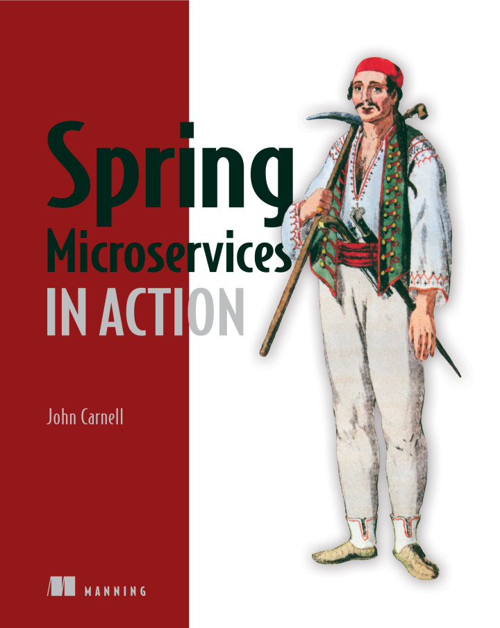

# spring-microservices-in-action

 

This repository contains the source code of the book "[Spring Microservices in Action (John Carnell)](https://www.manning.com/books/spring-microservices-in-action)" and the personal summary of technical essentials about Spring Boot for microservices.

## Overview
This source code was re-organized by the [original source code](https://www.manning.com/downloads/1578) of the book and I make sure each module is runnable.

## Structure

- **Servers**
   - [Config](https://github.com/wuyichen24/spring-microservices-in-action/wiki/Config-Server): Provide the configuration parameters for other services.
   - [Eureka](https://github.com/wuyichen24/spring-microservices-in-action/wiki/Eureka-Server): Service discovery.
   - [Zipkin](https://github.com/wuyichen24/spring-microservices-in-action/wiki/Zipkin-Server): API gateway.
   - [Zuul](https://github.com/wuyichen24/spring-microservices-in-action/wiki/Zuul-Server): Collect tracing data.
- **Services**
   - [Licensing](https://github.com/wuyichen24/spring-microservices-in-action/wiki/Licensing-Service): Manage (CRUD) license records.
   - [Organization](https://github.com/wuyichen24/spring-microservices-in-action/wiki/Organization-Service): Manage (CRUD) organization records.
   - [Authentication](https://github.com/wuyichen24/spring-microservices-in-action/wiki/Authentication-Service): Issue and validate access tokens, manage clients' and users' credentials and roles.
   - [Special Routes](https://github.com/wuyichen24/spring-microservices-in-action/wiki/Special-Routes-Service): Provide an alternate endpoint for a certain service.
- [**Database**](https://github.com/wuyichen24/spring-microservices-in-action/wiki/Database): Store license and organization records, clients' and users' credentials, alternate routes of any service.
- [**Message Queue (Kafka)**](https://github.com/wuyichen24/spring-microservices-in-action/wiki/Message-Queue): Notify the licensing service about any organization record modification.
- [**Cache (Redis)**](https://github.com/wuyichen24/spring-microservices-in-action/wiki/Cache): Cache any organization record which has been loaded before.
- [**Log Server**]()
   - [Splunk](https://github.com/wuyichen24/spring-microservices-in-action/wiki/Splunk-Server): Collect log information in local.
   - [Papertrail](): Collect log information in cloud.

## Technology Stack
- **Core**
   - Spring
      - Spring Boot
      - Spring Data
         - [Spring Data JPA](https://spring.io/projects/spring-data-jpa)
         - [Spring Data Redis](https://spring.io/projects/spring-data-redis)
      - Spring Cloud
         - [Spring Cloud Config](https://spring.io/projects/spring-cloud-config)
         - [Spring Cloud Stream](https://spring.io/projects/spring-cloud-stream)
         - [Spring Cloud Sleuth](https://spring.io/projects/spring-cloud-sleuth)
      - Spring Security
         - [Spring Security OAuth2](https://projects.spring.io/spring-security-oauth/docs/oauth2.html)
         - Spring Security JWT
         - Spring Security RSA
   - [Netflix OSS](https://netflix.github.io/)
      - [Netflix Eureka (service discovery)](https://github.com/Netflix/eureka)
      - [Netflix Zuul (service gateway)](https://github.com/Netflix/zuul)
      - [Netflix Hystrix (resiliency patterns)](https://github.com/Netflix/hystrix)
      - [Netflix Feign (HTTP API client)](https://github.com/OpenFeign/feign)
      - [Netflix Ribbon (service communication, load balancing)](https://github.com/Netflix/ribbon)
- **Message Queue**
   - [Apache Kafka](https://kafka.apache.org/) with [Apache ZooKeeper](https://zookeeper.apache.org/)
- **Cache**
   - [Redis](https://redis.io/)
- **Database**
   - [MySQL](https://www.mysql.com/)
- **Security**
   - [OAuth2](https://oauth.net/2/)
- **Log**
   - [Splunk](https://www.splunk.com/)
   - [Papertrail](https://papertrailapp.com/)
- **Trace**
   - [Apache Zipkin](https://zipkin.apache.org/)
- **Cluster Coordination**
   - [Apache ZooKeeper](https://zookeeper.apache.org/)

## Differences to The Original Source Code
- Use Gradle as Java build automation tool rather than Maven.
- Use MySQL as database rather than PostgreSQL.
- Change the port of the organization service to 8060 to avoid the address conflict with the licensing service.
- Change the port of the special routes service to 8040 to avoid the address conflict with the licensing service.
- Change the port of the authentication service to 8901 to make it same with the example in the book.
- Add the integration of Splunk for log aggregation locally (use both local Splunk and remote Papertrail).
- Use the original functionality in Logback for sending the log to the log servers (Splunk & Papertrail) rather than the solution in the Book (use Logspout to direct the docker output to the log servers).
- Replace the user_roles table by the authorities table for storing users' credentials to DB.
- Change the column name from user_name to username for the user_orgs table and the users table.
- Add comments to make the code easy to read.

## Getting Started
- Gradle (Version >= 4.4)
- [ZooKeeper](https://github.com/wuyichen24/spring-microservices-in-action/wiki/Getting-Started#install-apache-zookeeper)
- [Kafka](https://github.com/wuyichen24/spring-microservices-in-action/wiki/Getting-Started#install-apache-kafka)
- [Redis](https://github.com/wuyichen24/spring-microservices-in-action/wiki/Getting-Started#install-redis)
- [Splunk](https://github.com/wuyichen24/spring-microservices-in-action/wiki/Splunk)
- [Command Memo](https://github.com/wuyichen24/spring-microservices-in-action/wiki/Command-Memo)

## Technical Essentials
- **Spring Basics**
   - [Autowired](https://github.com/wuyichen24/spring-microservices-in-action/wiki/Autowired)
- **Data Model**
   - [SpringData JPA](https://github.com/wuyichen24/spring-microservices-in-action/wiki/SpringData-JPA)
- **Configuration**
   - [Configuration File Auto-loading](https://github.com/wuyichen24/spring-microservices-in-action/wiki/Configuration-File-Auto-loading)
   - [Configuration Encryption](https://github.com/wuyichen24/spring-microservices-in-action/wiki/Configuration-Encryption)
- **Service Discovery**
   - [Service Discovery with Eureka](https://github.com/wuyichen24/spring-microservices-in-action/wiki/Service-Discovery-with-Eureka)
- **Resiliency**
   - [Resiliency Patterns with Hystrix](https://github.com/wuyichen24/spring-microservices-in-action/wiki/Resiliency-Patterns-with-Hystrix)
   - [Configure Hystrix](https://github.com/wuyichen24/spring-microservices-in-action/wiki/Configure-Hystrix)
- **API Gateway**
   - [Service Gateway with Zuul](https://github.com/wuyichen24/spring-microservices-in-action/wiki/Service-Gateway-with-Zuul)
   - [Zuul Filters](https://github.com/wuyichen24/spring-microservices-in-action/wiki/Zuul-Filters)
- **Security**
   - [Protect Service with Spring Security and OAuth2](https://github.com/wuyichen24/spring-microservices-in-action/wiki/Protect-Service-with-Spring-Security-and-OAuth2)
   - [Use JWT as Access Token](https://github.com/wuyichen24/spring-microservices-in-action/wiki/Use-JWT-as-Access-Token)
   - [Store Clients and Users' Credentials to DB](https://github.com/wuyichen24/spring-microservices-in-action/wiki/Store-Clients-and-Users'-Credentials-to-DB)
- **Stream**
   - [Integrate with Message Queue (Kafka)](https://github.com/wuyichen24/spring-microservices-in-action/wiki/Integrate-with-Message-Queue-(Kafka))
- **Cache**
   - [Integrate with Redis](https://github.com/wuyichen24/spring-microservices-in-action/wiki/Integrate-with-Redis)
- **Logging**
   - [Tune Logging](https://github.com/wuyichen24/spring-microservices-in-action/wiki/Tune-Logging)
   - [Log Aggregation](https://github.com/wuyichen24/spring-microservices-in-action/wiki/Log-Aggregation)
- **Tracing**
   - [Send Trace to Zipkin](https://github.com/wuyichen24/spring-microservices-in-action/wiki/Send-Trace-to-Zipkin)
- **Deployment**
   - [Build Runnable Jar](https://github.com/wuyichen24/spring-microservices-in-action/wiki/Build-Runnable-Jar)

## Study Notes
- [Google Doc](https://docs.google.com/document/d/1yaZZDy-Sf-pwobK85re5FQCU8X7GGXpmERXtA5CXm4o/edit?usp=sharing)
